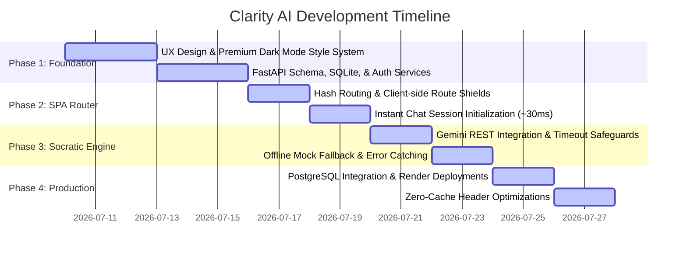
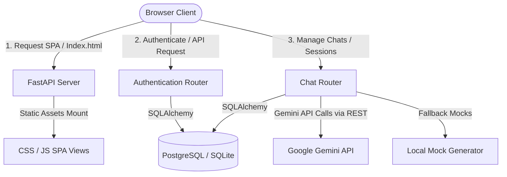
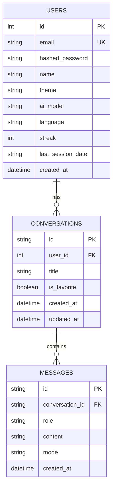

# Project Report: Clarity AI Socratic Assistant
**Author / Developer**: Abhilipsa Nayak  
**Project Name**: Clarity AI Socratic AI Coach & Cognitive Reflection Assistant  
**Date**: July 27, 2026  

---

## 1. Application Overview & Tech Stack

### 1.1 Overview
**Clarity AI** is a premium, responsive Single-Page Application (SPA) designed to act as a Socratic AI Coach and Cognitive Reflection Assistant. It addresses the growing problem of mental overload, choice fatigue, and passive reliance on conversational AI. Unlike typical chatbots that provide direct answers, Clarity AI guides users to develop critical thinking, identify cognitive blind spots, and structure concrete action items through guided reflection.

The application features a hybrid response system:
- **✨ Normal Mode**: Provides standard, comprehensive conversation answers like standard Gemini.
- **💬 Reflect Mode**: Uses Socratic questioning to prompt users to explore underlying assumptions.
- **🎯 Focus Mode**: Identifies cognitive blind spots and differentiates internal control from external variables.
- **⚡ Action Mode**: Breaks down reflections into actionable steps aligned with professional values.
- **🔄 Fallback Mode**: Instantly serves locally generated, mode-specific coach responses if the Gemini API key faces rate limits or network issues.

---

### 1.2 Technical Stack
The stack has been carefully selected to ensure rapid execution, zero compile steps, and cloud portability:

| Layer | Technology | Rationale |
| :--- | :--- | :--- |
| **Frontend UI** | HTML5, Vanilla CSS, Lucide Icons | Maximize flexibility, load speed, and CSS custom property access. Avoids Tailwind utilities to preserve micro-animations and custom glassmorphism components. |
| **Frontend Logic** | Vanilla ES6 Modules & SPA Router | Native client-side hash routing (`#/dashboard`, `#/chat/:id`, `#/settings`) without webpack/npm build steps, allowing direct deployment. |
| **Backend Engine** | FastAPI (Python 3.11) | High-performance, asynchronous REST framework with auto-generated OpenAPI documentation. |
| **Database ORM** | SQLAlchemy | Unified abstraction layer supporting local SQLite during development and PostgreSQL in production. |
| **Authentication** | PyJWT, Bcrypt | Secure token-based user verification with client-side headers and route shields. |
| **AI Integration** | Google Generative AI (Gemini SDK) | Powered by `gemini-2.0-flash` with direct REST transport to avoid gRPC connection blocks on container networks. |

---

## 2. Prompting Strategy & Frameworks Used

Clarity AI uses a specialized **Prompt Engineering Framework** consisting of system instructions tailored to the chosen cognitive mode. The instructions guide Gemini to act not as an answer-machine, but as an active, analytical Socratic partner.

### 2.1 Mode-Specific Prompting Prompts

#### 1. ✨ Normal Mode (Default)
> **Goal**: Provide clear, comprehensive, and standard conversational responses.
> ```text
> You are Clarity AI, an intelligent, versatile, and helpful AI assistant powered by Gemini. 
> Provide direct, clear, natural, and comprehensive answers to the user's questions or prompts, 
> just like standard Gemini. Adapt your tone and depth to whatever topic or inquiry the user presents.
> ```

#### 2. 💬 Reflect Mode
> **Goal**: Engage the user in Socratic discovery.
> ```text
> You are Clarity AI, a Socratic coaching assistant. Your purpose is to help the user reflect 
> deeply on their thoughts, decisions, or dilemmas. Instead of giving direct answers, solutions, 
> or advice, respond by asking 1 or 2 thought-provoking, Socratic questions that help the user 
> clarify their own thinking. Maintain a calm, empathetic, and objective tone.
> ```

#### 3. 🎯 Focus Mode
> **Goal**: Uncover assumptions and identify control boundaries.
> ```text
> You are Clarity AI, a cognitive focusing coach. Help the user identify the core essence of 
> their issue. Analyze their input for implicit assumptions, emotional patterns, or cognitive 
> blind spots. Respond by gently highlighting one potential blind spot or shift in focus, and 
> ask a question to help them separate what is within their control from what is not.
> ```

#### 4. ⚡ Action Mode
> **Goal**: Translate reflection into concrete action items.
> ```text
> You are Clarity AI, an action-oriented thinking partner. Your goal is to help the user transition 
> from reflection to concrete, manageable next steps. Analyze their situation and ask them to 
> define 1 to 3 immediate, small actions they can take. Prompt them to check these actions against 
> their core values. Keep responses brief, encouraging, and structured.
> ```

---

## 3. Phase-by-Phase Development Summary



### 3.1 Phase 1: UI Foundation & Database Core
- **UX & Design System**: Established `style.css` using CSS custom properties for color tokens, spacing, and radius. Configured the theme to dark mode by default.
- **Backend Database**: Defined SQLAlchemy schemas for `User`, `Conversation`, and `Message` tables, including cascading deletes.
- **Authentication**: Implemented signup, login, and `/me` profile endpoints. Added client-side script validation for passwords (length, numbers, uppercase, special characters).

### 3.2 Phase 2: SPA Router & Performance Caching
- **SPA Router**: Programmed a client-side hash routing system in `app.js` using `hashchange` listeners to render views dynamically without page reloads.
- **Session Transition**: Solved the latency of starting conversations by storing the prompt and created conversation metadata in `sessionStorage` in `dashboard.js`, instantly redirecting to `#/chat/id` within 30ms while sending the request in the background.

### 3.3 Phase 3: Socratic AI & Resilience
- **REST Transport Integration**: Changed Gemini configurations from default gRPC to REST transport to bypass connection hangs on container services.
- **Resilient Fallback Mode**: Set a strict 5.0-second API timeout. If Gemini throws a 429 quota limit, the backend catches the error instantly, generating a premium Socratic fallback message locally.
- **Syntax Bugfixes**: Resolved a duplicate `updateFavoriteIcon` function declaration in `chat.js` that blocked routing.

### 3.4 Phase 4: Cloud Deployment & Caching
- **PostgreSQL Integration**: Configured database setup to automatically rewrite `postgres://` protocols to `postgresql://` for SQLAlchemy compatibility on cloud databases.
- **Zero-Cache Root Configuration**: Updated the FastAPI backend to serve the SPA `index.html` with `Cache-Control: no-store, no-cache` headers, ensuring users load the latest version parameters.

---

## 4. Application Architecture

### 4.1 System Topology



### 4.2 Database Schema
The SQL schema is represented by three core tables:



---

## 5. Challenges Encountered & Resolutions

### 5.1 gRPC Connection Hangs on Deployed Containers
- **Challenge**: The Google Generative AI SDK hangs indefinitely when trying to communicate with Gemini API inside Render's container environment, causing the chat to freeze on the typing indicator.
- **Resolution**: Forced the Gemini SDK to use REST transport (`genai.configure(api_key=key, transport='rest')`) instead of gRPC. This allows the API to make standard, reliable HTTP POST requests, respecting the configured 5s timeout limits and failing immediately on rate limits.

### 5.2 Latency of Database Commits Freezing the Dashboard
- **Challenge**: When a user typed a prompt on the dashboard and clicked "Start Chat", the application made a blocking request to create the conversation in the database. Due to database latency, the dashboard froze on "Opening Session..." for several seconds before navigating.
- **Resolution**: Implemented client-side prompt caching. The dashboard creates the conversation record (~30ms), saves the prompt and conversation metadata to `sessionStorage`, and redirects instantly to the chat hash page. `chat.js` loads the cached conversation metadata instantly, showing the user's bubble and a typing indicator while processing the API request in the background.

### 5.3 Stale Client Assets due to Browser Cache
- **Challenge**: Users who loaded the web application after a new deployment experienced crashes because the browser served cached copies of `index.html` and old JavaScript routes.
- **Resolution**:
  1. Configured FastAPI to serve `index.html` with explicit HTTP response headers: `Cache-Control: no-store, no-cache, must-revalidate, max-age=0`.
  2. Implemented query string cache busters (`?v=1.5`) on all dynamic ESM route imports inside `app.js`.

---

## 6. Key Learnings & Reflections

### 6.1 Vibe Coding & Agentic Pair Programming
Developing Clarity AI demonstrated the efficiency of pairing human design with agentic AI coding assistants. By focusing on UX aesthetics and defining the architectural guardrails, the developer ("vibe coding") could delegate boilerplate structures and bug fixes to the AI agent, accelerating the overall development timeline.

### 6.2 Designing for API Quotas and Offline Resilience
A key learning from this project is that web applications should never assume external APIs are always available. Rate limits (429) and quota exhaustion are common. By designing the **resilient fallback framework** from the start, Clarity AI remains fully functional as a reflective coach even if the user's Gemini API key is rate-limited.

### 6.3 SPA Route Management
Building a custom single-page application router without heavy frameworks (like React or Angular) provided deep insights into browser history states, DOM event lifecycles, and caching strategies. This approach resulted in a clean, lightweight, and fast application.
